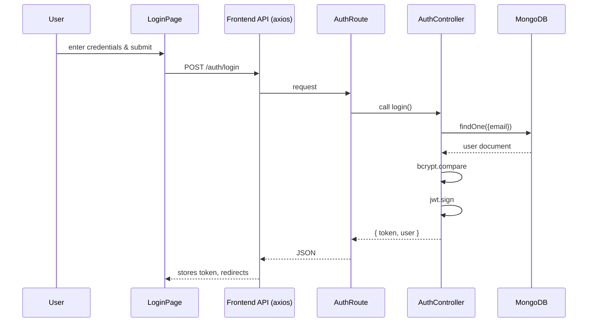
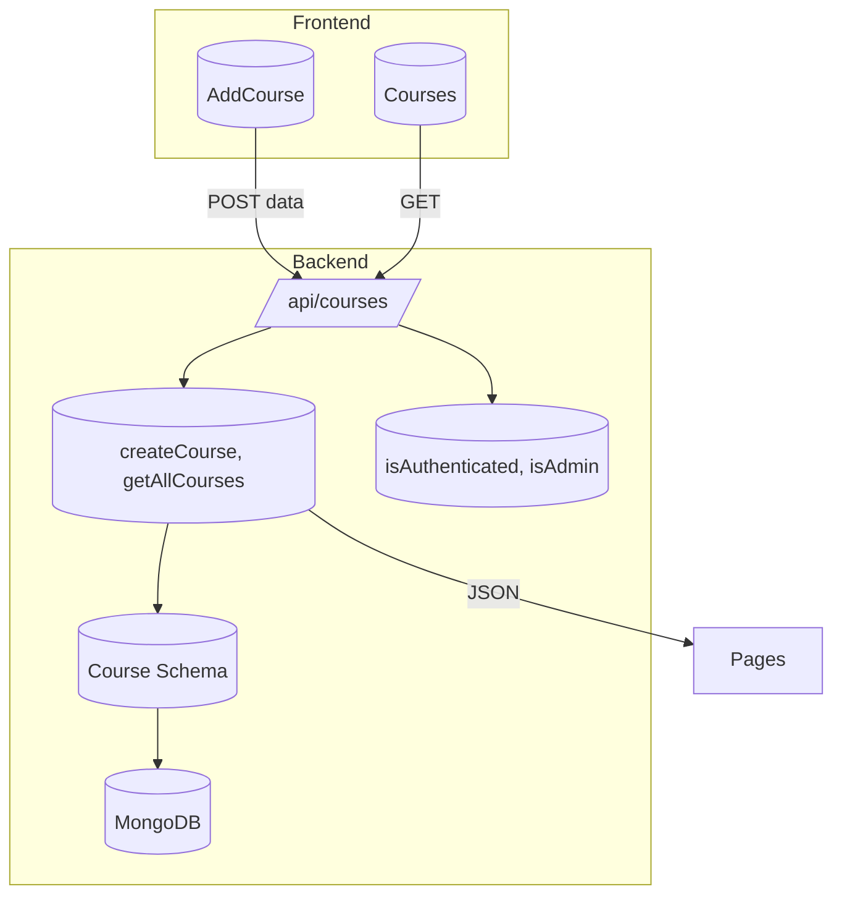
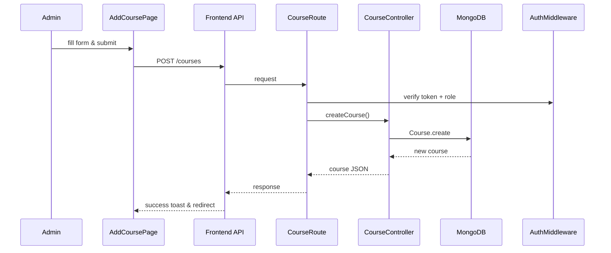

# Authentication Feature Documentation

# credentials:
- Admin: {email:admin@gmail.com, password: admin123}
- Instructors:
  - ayush@gmail.com, ayush@123
  - vishal@gmail.com, vishal@123 
  - atharva@gmail.com, atharva@123

# URLs:
- frontend: https://course-scheduler-ten.vercel.app/
- backend: https://course-scheduler-xouz.onrender.com/api

# Routes:
## Amin routes:
- Login page: https://course-scheduler-ten.vercel.app/
- Admin Dashboard: https://course-scheduler-ten.vercel.app/admin
- Add Instructor: https://course-scheduler-ten.vercel.app/admin/add-instructor
- Instructors List: https://course-scheduler-ten.vercel.app/admin/instructors
- Add Course: https://course-scheduler-ten.vercel.app/admin/add-course
- List of all Courses: https://course-scheduler-ten.vercel.app/admin/courses
- Assign Lecture to course: https://course-scheduler-ten.vercel.app/admin/assign-lecture
- List of Lectures of all courses: https://course-scheduler-ten.vercel.app/admin/lectures

## Instructor Routes:
- Instructor Dashboard: https://course-scheduler-ten.vercel.app/instructor/dashboard
---
## Overview

The Authentication feature secures access by validating instructor and admin credentials. Users submit their email and password; the system verifies them and issues a JWT. This enables role-based access control across protected routes.

---


## Component Structure

### 1. Presentation Layer

#### **Login Page** (`frontend/src/pages/Login.jsx`)
- Purpose: Renders a form for email and password.
- Key State:  
  - `email` (string)  
  - `password` (string)
- Key Methods:  
  - `handleLogin(e)`: Calls `API.post("/auth/login")`, stores token, redirects based on role.

### 2. Business Layer

#### **Auth Controller** (`backend/controllers/auth.controller.js`)
- Purpose: Validates user credentials and generates JWT.
- Key Steps:  
  1. Retrieve `{ email, password }` from `req.body`.  
  2. Lookup user via `Instructor.findOne({ email })`.  
  3. Compare passwords with `bcrypt.compare`.  
  4. Sign JWT with `{ id, role }`.  
  5. Respond with `{ message, token, user }`.  
- Error Handling:  
  - 400 if invalid credentials.  
  - 500 on server error. 

### 3. Data Access Layer

*All data access occurs via Mongoose models; no separate DAL classes.*

### 4. Data Models

#### **Instructor** (`backend/models/instructor.model.js`)
| Property | Type   | Details                            |
|----------|--------|------------------------------------|
| `name`   | String | Required                           |
| `email`  | String | Required, unique                   |
| `password`| String| Required, hashed via bcrypt       |
| `role`   | String | Enum: `"admin"`, `"instructor"`; default `"instructor"` |

Timestamps are enabled. 

### 5. API Integration

#### POST /api/auth/login

```api
{
  "title": "User Login",
  "description": "Authenticate instructor/admin and issue JWT",
  "method": "POST",
  "baseUrl": "http://localhost:8000",
  "endpoint": "/api/auth/login",
  "headers": [
    { "key": "Content-Type", "value": "application/json", "required": true }
  ],
  "bodyType": "json",
  "requestBody": "{\n  \"email\": \"user@example.com\",\n  \"password\": \"securePass123\"\n}",
  "responses": {
    "200": {
      "description": "Login successful",
      "body": "{\n  \"message\": \"Login successful\",\n  \"token\": \"<jwt>\",\n  \"user\": { \"id\": \"<id>\", \"name\": \"<name>\", \"email\": \"<email>\", \"role\": \"admin\" }\n}"
    },
    "400": {
      "description": "Invalid credentials",
      "body": "{ \"message\": \"Invalid email or password\" }"
    },
    "500": {
      "description": "Server error",
      "body": "{ \"message\": \"Error message\" }"
    }
  }
}
```

### Feature Flow


---

# Course Management Feature Documentation

## Overview

The Course Management feature allows admins to create new courses and retrieve existing ones. Courses include metadata like name, level, description, and optional image.

## Architecture Overview



## Component Structure

### 1. Presentation Layer

#### **AddCourse** (`frontend/src/pages/AddCourse.jsx`)
- Purpose: Form to enter `name`, `level`, `description`, `image`.
- State: `formData` with fields above.
- Methods:  
  - `handleChange(e)`: Updates form state.  
  - `handleSubmit(e)`: Posts to `/courses`, shows toast, redirects. 

#### **Courses** (`frontend/src/pages/course.jsx`)
- Purpose: Displays a grid of courses.
- State: `courses` array.
- Methods:  
  - `fetchCourses()`: GET `/courses` and set state. 

#### **CourseCard** (`frontend/src/components/CourseCard.jsx`)
- Props: `{ course }`.
- Renders card with image, name, level, description.  

### 2. Business Layer

#### **Course Controller** (`backend/controllers/course.controller.js`)
| Method         | Description                                | Returns         |
|----------------|--------------------------------------------|-----------------|
| `createCourse` | Validates required fields and creates DB record | Created course object |
| `getAllCourses`| Fetches all courses                       | Array of courses |

Error handling: 400 on missing fields; 500 on DB errors. 

### 3. Data Models

#### **Course** (`backend/models/course.model.js`)
| Property    | Type    | Details                                    |
|-------------|---------|--------------------------------------------|
| `name`      | String  | Required                                   |
| `level`     | String  | Enum: Beginner, Intermediate, Advanced; required |
| `description`| String | Optional                                   |
| `image`     | String  | URL optional                               |

Timestamps enabled. 

### 4. API Integration

#### POST /api/courses

```api
{
  "title": "Create Course",
  "description": "Add a new course; admin only",
  "method": "POST",
  "baseUrl": "http://localhost:8000",
  "endpoint": "/api/courses",
  "headers": [
    { "key": "Authorization", "value": "Bearer <token>", "required": true }
  ],
  "bodyType": "json",
  "requestBody": "{\n  \"name\": \"Algebra I\",\n  \"level\": \"Beginner\",\n  \"description\": \"Introductory algebra\",\n  \"image\": \"http://...\"\n}",
  "responses": {
    "201": {
      "description": "Course created",
      "body": "{ \"_id\": \"<id>\", \"name\": \"Algebra I\", ... }"
    },
    "400": {
      "description": "Missing fields",
      "body": "{ \"message\": \"course name and level are required\" }"
    },
    "401": { "description": "No token provided" },
    "403": { "description": "Admin access required" }
  }
}
```

#### GET /api/courses

```api
{
  "title": "List Courses",
  "description": "Retrieve all courses; authenticated users",
  "method": "GET",
  "baseUrl": "http://localhost:8000",
  "endpoint": "/api/courses",
  "headers": [
    { "key": "Authorization", "value": "Bearer <token>", "required": true }
  ],
  "responses": {
    "200": {
      "description": "List of courses",
      "body": "[{ \"_id\": \"...\", \"name\": \"...\" }, ...]"
    }
  }
}
```

### Feature Flow



---

