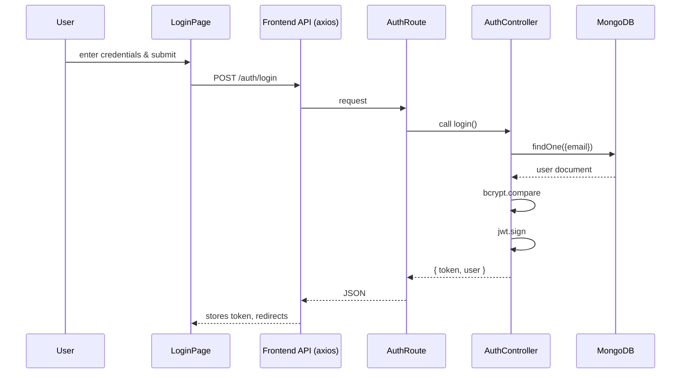
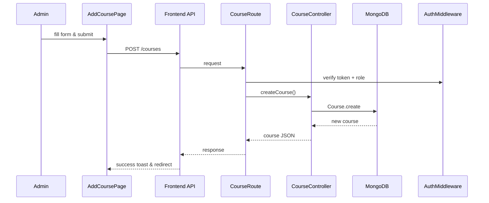

# Course Scheduler

A modern web application to manage courses, instructors, and assign lectures with clash prevention mechanisms. Built using React, Node.js, Express, and MongoDB.

---

## 🚀 Quick Start

### ⚙️ Prerequisites
Ensure you have [Node.js](https://nodejs.org/) installed (v16+ recommended).

### 📂 Repository Structure
- `backend/`: Node.js + Express API server.
- `frontend/`: React + Vite client-side single page app.

---

## 🛠️ Installation & Setup

### 1. Backend Setup
1. Open a terminal and navigate to the backend folder:
   ```bash
   cd backend
   ```
2. Install dependencies:
   ```bash
   npm install
   ```
3. Set up environment variables. Create a `.env` file in the `backend/` directory:
   ```env
   MONGO_URL=mongodb+srv://<username>:<password>@cluster.mongodb.net/CourseScheduler
   PORT=8000
   JWT_SECRET=sjfklfvkvliifsdkud
   ```
4. Start the backend development server:
   ```bash
   npm run dev
   ```
   *Note: On startup, if the database has no users, it will auto-seed the default administrator and instructor credentials listed below.*

### 2. Frontend Setup
1. Open another terminal and navigate to the frontend folder:
   ```bash
   cd frontend
   ```
2. Install dependencies:
   ```bash
   npm install
   ```
3. Start the frontend Vite development server:
   ```bash
   npm run dev
   ```
4. Open the application in your browser at `http://localhost:5173`.

---

## 🔐 Credentials & Accounts

When the backend runs for the first time, it seeds the database with the following default accounts. Use them to log in:

### 👤 Administrator
- **Email:** `admin@gmail.com`
- **Password:** `admin123`
- **Role:** `admin` (Can create courses, add instructors, and assign lectures)

### 👨‍🏫 Instructors
- **Email:** `ayush@gmail.com` | **Password:** `ayush@123`
- **Email:** `vishal@gmail.com` | **Password:** `vishal@123`
- **Email:** `atharva@gmail.com` | **Password:** `atharva@123`
- **Role:** `instructor` (Can view assigned lecture schedules)

---

## 🌐 URLs & Routing

### Local URLs:
- **Frontend App:** `http://localhost:5173`
- **Backend API:** `http://localhost:8000/api`

### Production URLs:
- **Frontend App:** `https://course-scheduler-ten.vercel.app/`
- **Backend API:** `https://course-scheduler-xouz.onrender.com/api`

### 🗺️ Admin Pages (Protected)
- **Overview Dashboard:** `/admin` (Real-time count of courses, instructors, and scheduled lectures)
- **Add Instructor:** `/admin/add-instructor` (Register new instructors)
- **Instructors List:** `/admin/instructors` (List of registered instructors)
- **Add Course:** `/admin/add-course` (Create new courses)
- **Courses List:** `/admin/courses` (View all courses)
- **Assign Lecture:** `/admin/assign-lecture` (Schedule a lecture for an instructor on a specific date)
- **Lectures List:** `/admin/lectures` (View all assigned lectures)

### 🗺️ Instructor Pages (Protected)
- **Instructor Dashboard:** `/instructor/dashboard` (View calendar/schedule of assigned lectures)

---

## 🏗️ Architecture & Component Design

### 1. Presentation Layer (React + React Router 7 + Tailwind CSS)
- **ProtectedRoute (`frontend/src/components/ProtectedRoute.jsx`):** Secures endpoints based on roles (`admin` or `instructor`). Handles token decoding, expiry checks, and automatic navigation redirection.
- **AdminLayout (`frontend/src/components/AdminLayout.jsx`):** Shared responsive sidebar layout rendering the dashboard navigation across all administrative sub-pages.
- **Login (`frontend/src/pages/Login.jsx`):** Multi-role authentication entry. Redirects authenticated users automatically.
- **CourseCard (`frontend/src/components/CourseCard.jsx`):** Renders course details dynamically.

### 2. Business Logic & Controllers (Express)
- **Auth Controller (`backend/controllers/auth.controller.js`):** Validates credentials, compares passwords using `bcrypt`, and generates JWT.
- **Course Controller (`backend/controllers/course.controller.js`):** Creates courses and fetches all courses.
- **Instructor Controller (`backend/controllers/instructor.controller.js`):** Regulates instructor creation, fetch, and personal schedule.
- **Lecture Controller (`backend/controllers/lecture.controller.js`):** Manages lecture scheduling, verifying schedule conflicts before assigning.

### 3. Middleware
- **isAuthenticated (`backend/middlewares/auth.middleware.js`):** Verifies the Bearer JWT in the request header.
- **isAdmin (`backend/middlewares/auth.middleware.js`):** Restricts administrative actions to authorized accounts.

### 4. Database Models (Mongoose)
- **Instructor (`backend/models/instructor.model.js`):** Represents users (Admin or Instructor).
- **Course (`backend/models/course.model.js`):** Represents classes/courses.
- **Lecture (`backend/models/lecture.model.js`):** Links Course, Instructor, and a specific Date with a unique constraint index.

---

## 🔄 Sequence Flows

### User Login Flow


### Course Creation Flow

