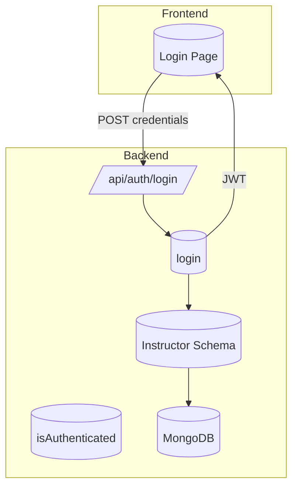
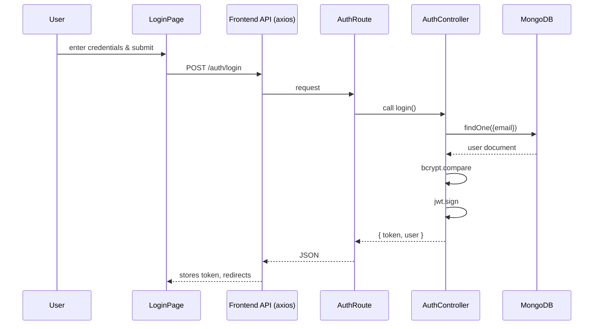
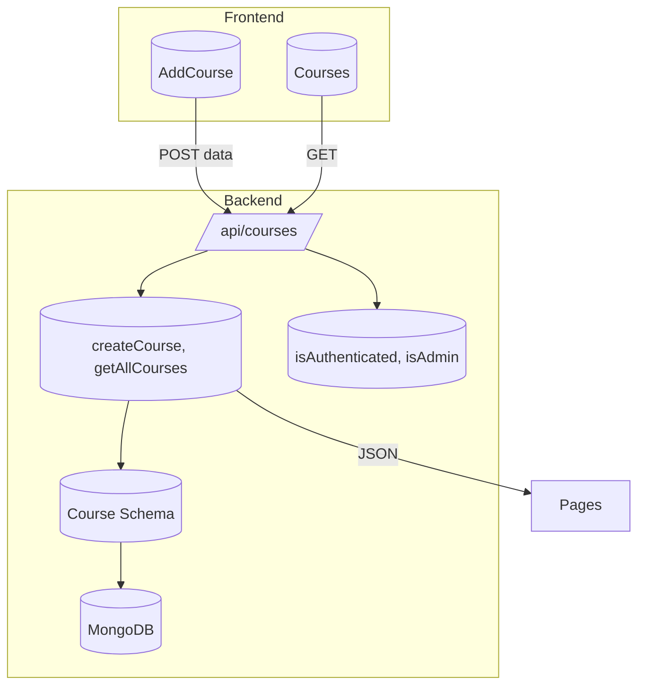
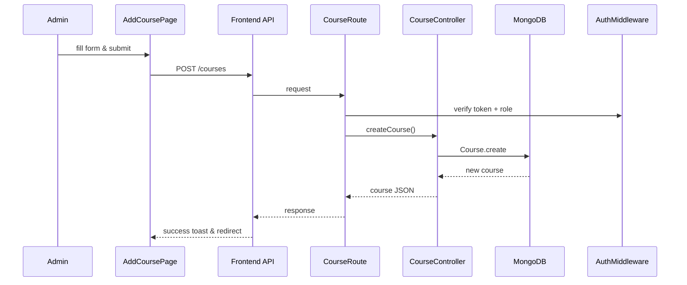

# Authentication Feature Documentation

# credentials:
Admin: {email:admin@gmail.com, password: admin123}
Instructors: {follow this pattern || email: instructorName, password: instructorName@123 || e.g.: ayush@gmail.com, ayush@123}

## Overview

The Authentication feature secures access by validating instructor and admin credentials. Users submit their email and password; the system verifies them and issues a JWT. This enables role-based access control across protected routes.

## Architecture Overview



## Component Structure

### 1. Presentation Layer

#### **Login Page** (`frontend/src/pages/Login.jsx`)
- Purpose: Renders a form for email and password.
- Key State:  
  - `email` (string)  
  - `password` (string)
- Key Methods:  
  - `handleLogin(e)`: Calls `API.post("/auth/login")`, stores token, redirects based on role.

### 2. Business Layer

#### **Auth Controller** (`backend/controllers/auth.controller.js`)
- Purpose: Validates user credentials and generates JWT.
- Key Steps:  
  1. Retrieve `{ email, password }` from `req.body`.  
  2. Lookup user via `Instructor.findOne({ email })`.  
  3. Compare passwords with `bcrypt.compare`.  
  4. Sign JWT with `{ id, role }`.  
  5. Respond with `{ message, token, user }`.  
- Error Handling:  
  - 400 if invalid credentials.  
  - 500 on server error. 

### 3. Data Access Layer

*All data access occurs via Mongoose models; no separate DAL classes.*

### 4. Data Models

#### **Instructor** (`backend/models/instructor.model.js`)
| Property | Type   | Details                            |
|----------|--------|------------------------------------|
| `name`   | String | Required                           |
| `email`  | String | Required, unique                   |
| `password`| String| Required, hashed via bcrypt       |
| `role`   | String | Enum: `"admin"`, `"instructor"`; default `"instructor"` |

Timestamps are enabled. 

### 5. API Integration

#### POST /api/auth/login

```api
{
  "title": "User Login",
  "description": "Authenticate instructor/admin and issue JWT",
  "method": "POST",
  "baseUrl": "http://localhost:8000",
  "endpoint": "/api/auth/login",
  "headers": [
    { "key": "Content-Type", "value": "application/json", "required": true }
  ],
  "bodyType": "json",
  "requestBody": "{\n  \"email\": \"user@example.com\",\n  \"password\": \"securePass123\"\n}",
  "responses": {
    "200": {
      "description": "Login successful",
      "body": "{\n  \"message\": \"Login successful\",\n  \"token\": \"<jwt>\",\n  \"user\": { \"id\": \"<id>\", \"name\": \"<name>\", \"email\": \"<email>\", \"role\": \"admin\" }\n}"
    },
    "400": {
      "description": "Invalid credentials",
      "body": "{ \"message\": \"Invalid email or password\" }"
    },
    "500": {
      "description": "Server error",
      "body": "{ \"message\": \"Error message\" }"
    }
  }
}
```

### Feature Flow



### Key Classes Reference

| Class           | Location                                              | Responsibility                  |
|-----------------|-------------------------------------------------------|---------------------------------|
| `Instructor`    | `backend/models/instructor.model.js`                  | Defines user schema            |
| `login`         | `backend/controllers/auth.controller.js`              | Handles authentication logic   |
| `isAuthenticated`| `backend/middlewares/auth.middleware.js`              | Verifies JWT on protected routes |

---

# Course Management Feature Documentation

## Overview

The Course Management feature allows admins to create new courses and retrieve existing ones. Courses include metadata like name, level, description, and optional image.

## Architecture Overview



## Component Structure

### 1. Presentation Layer

#### **AddCourse** (`frontend/src/pages/AddCourse.jsx`)
- Purpose: Form to enter `name`, `level`, `description`, `image`.
- State: `formData` with fields above.
- Methods:  
  - `handleChange(e)`: Updates form state.  
  - `handleSubmit(e)`: Posts to `/courses`, shows toast, redirects. 

#### **Courses** (`frontend/src/pages/course.jsx`)
- Purpose: Displays a grid of courses.
- State: `courses` array.
- Methods:  
  - `fetchCourses()`: GET `/courses` and set state. 

#### **CourseCard** (`frontend/src/components/CourseCard.jsx`)
- Props: `{ course }`.
- Renders card with image, name, level, description.  

### 2. Business Layer

#### **Course Controller** (`backend/controllers/course.controller.js`)
| Method         | Description                                | Returns         |
|----------------|--------------------------------------------|-----------------|
| `createCourse` | Validates required fields and creates DB record | Created course object |
| `getAllCourses`| Fetches all courses                       | Array of courses |

Error handling: 400 on missing fields; 500 on DB errors. 

### 3. Data Models

#### **Course** (`backend/models/course.model.js`)
| Property    | Type    | Details                                    |
|-------------|---------|--------------------------------------------|
| `name`      | String  | Required                                   |
| `level`     | String  | Enum: Beginner, Intermediate, Advanced; required |
| `description`| String | Optional                                   |
| `image`     | String  | URL optional                               |

Timestamps enabled. 

### 4. API Integration

#### POST /api/courses

```api
{
  "title": "Create Course",
  "description": "Add a new course; admin only",
  "method": "POST",
  "baseUrl": "http://localhost:8000",
  "endpoint": "/api/courses",
  "headers": [
    { "key": "Authorization", "value": "Bearer <token>", "required": true }
  ],
  "bodyType": "json",
  "requestBody": "{\n  \"name\": \"Algebra I\",\n  \"level\": \"Beginner\",\n  \"description\": \"Introductory algebra\",\n  \"image\": \"http://...\"\n}",
  "responses": {
    "201": {
      "description": "Course created",
      "body": "{ \"_id\": \"<id>\", \"name\": \"Algebra I\", ... }"
    },
    "400": {
      "description": "Missing fields",
      "body": "{ \"message\": \"course name and level are required\" }"
    },
    "401": { "description": "No token provided" },
    "403": { "description": "Admin access required" }
  }
}
```

#### GET /api/courses

```api
{
  "title": "List Courses",
  "description": "Retrieve all courses; authenticated users",
  "method": "GET",
  "baseUrl": "http://localhost:8000",
  "endpoint": "/api/courses",
  "headers": [
    { "key": "Authorization", "value": "Bearer <token>", "required": true }
  ],
  "responses": {
    "200": {
      "description": "List of courses",
      "body": "[{ \"_id\": \"...\", \"name\": \"...\" }, ...]"
    }
  }
}
```

### Feature Flow



---

# Instructor Management Feature Documentation

*(Similar structure)*

---

# Lecture Scheduling Feature Documentation

*(Similar structure)*

---

# Middleware & Utilities

## Authentication Middleware (`backend/middlewares/auth.middleware.js`)
- `isAuthenticated`: Verifies JWT in `Authorization` header; sets `req.user`.  
- `isAdmin`: Ensures `req.user.role === "admin"`; else 403. 

## Database Connector (`backend/utils/database.utils.js`)
- `connectDB()`: Connects to MongoDB via `process.env.MONGO_URL`. Logs status. 

---

# Application Entry & Configuration

## `backend/index.js`
- Sets up Express with CORS (origin `http://localhost:5173`), JSON parsing, cookie parser.  
- Mounts routes:  
  - `/api/auth` → `auth.route.js`  
  - `/api/instructors` → `instructor.route.js`  
  - `/api/courses` → `course.route.js`  
  - `/api/lectures` → `lecture.route.js`  
- Starts server on `process.env.PORT || 3000`. 

## `backend/package.json`
Lists dependencies: Express, Mongoose, JWT, bcrypt, dotenv, cors, cookie-parser, nodemon. 

---

# Frontend Infrastructure

## API Client (`frontend/src/api/axios.js`)
- Creates Axios instance with `baseURL: "http://localhost:8000/api"`.  
- Attaches JWT from `localStorage` to `Authorization` header. 

## Global Styles & Configs
- ESLint config: `frontend/eslint.config.js` enforces React hooks rules.   
- `index.html`: mounts `<div id="root">`.   
- Tailwind & PostCSS: `tailwind.config.js`, `postcss.config.js`.    
- Vite: `vite.config.js` enables React plugin. 

---

# Key Classes Reference

| Class/Component         | Location                                            | Responsibility                             |
|-------------------------|-----------------------------------------------------|--------------------------------------------|
| `login`                | `backend/controllers/auth.controller.js`            | Auth logic                                 |
| `createCourse`         | `backend/controllers/course.controller.js`          | Course creation                            |
| `createInstructor`     | `backend/controllers/instructor.controller.js`      | Instructor signup                          |
| `createLecture`        | `backend/controllers/lecture.controller.js`         | Lecture assignment                         |
| `isAuthenticated`      | `backend/middlewares/auth.middleware.js`            | JWT verification                           |
| `connectDB`            | `backend/utils/database.utils.js`                   | DB connection                              |
| `API`                  | `frontend/src/api/axios.js`                         | Axios instance with auth interceptor       |
| `Login`                | `frontend/src/pages/Login.jsx`                      | Login form                                 |
| `AddCourse`            | `frontend/src/pages/AddCourse.jsx`                  | Course creation form                       |
| `CourseCard`           | `frontend/src/components/CourseCard.jsx`            | Course display card                        |
| `Navbar`               | `frontend/src/components/Navbar.jsx`                | Top-level navigation and logout            |

---

This documentation covers all selected files and their relationships across frontend and backend.